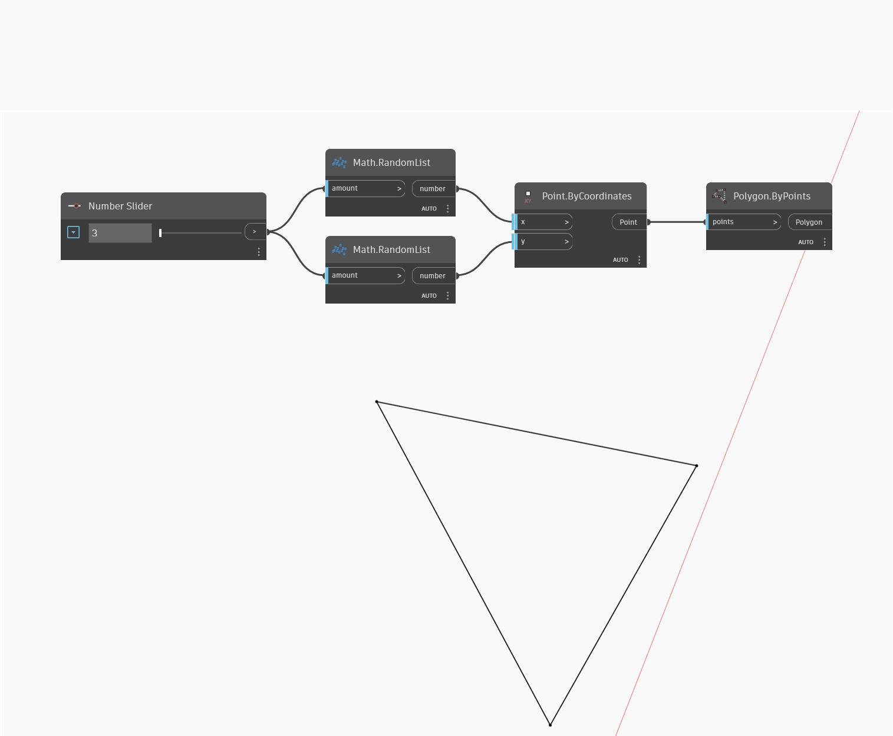

## In Depth
`Polygon.ByPoints` creates a polygon from a list of input points. The points will be connected in the order of the list they originate from. 

In the example below, we create a list of random points driven by a number slider. We then use a `Polygon.ByPoints` node to connect the points with lines. 

___
## Example File

