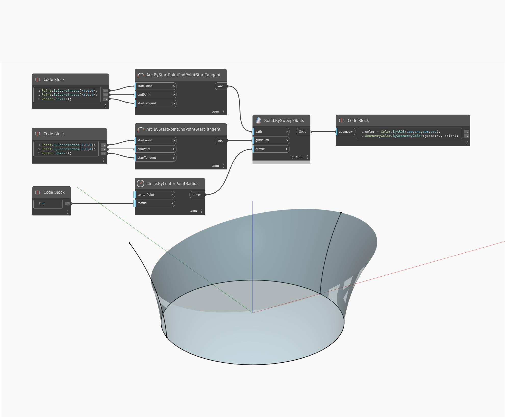

## In Depth
`Solid.BySweep2Rails` returns a new solid from a curve profile swept along two curve rails.

In the example below, a new solid is returned from sweeping a circle along two arcs as rails. Switching the arc inputs in `path` and `guideRail` will change which arc the sweep is perpendicular to.

___
## Example File

