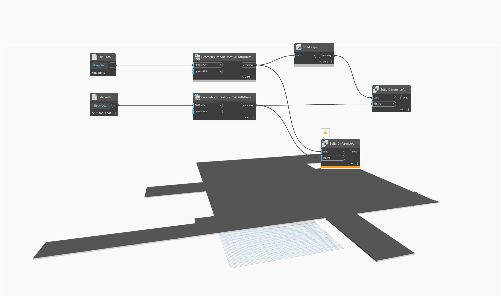

## In Depth
`Solid.Repair` attempts to repair solids which have invalid geometry, as well as potentially performing optimizations. `Solid.Repair` will return a new solid object. 

This node is useful when you encounter errors performing operations on imported or converted geometry.

In the example below, `Solid.Repair` is used to repair geometry from an **.SAT** file. The geometry in the file fails to boolean or trim, and `Solid.Repair` cleans up any *invalid geometry* that is causing the failure.

In general, you should not need to use this functionality on geometry you create in Dynamo, only on geometry from external sources. If you find that is not the case, please report a bug to the Dynamo team Github
___
## Example File

