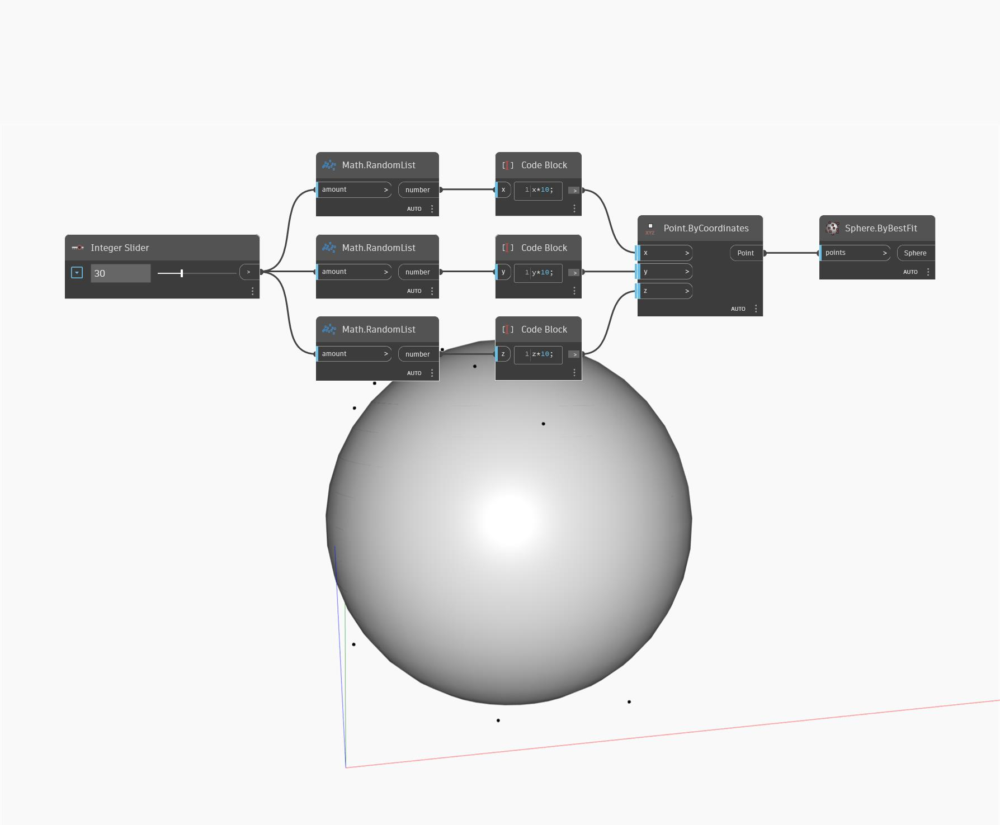

## In Depth
Sphere by Best Fit will create a sphere based on a list of points as input. The sphere will be created to minimize the average distance from the list of points to the surface of the sphere. In the example below, we generate a set of random numbers to use as x,y, and z coordinates for a list of points. The number of points is controlled by an integer slider. The list of points is used as the input for a Sphere ByBestFit node.
___
## Example File

