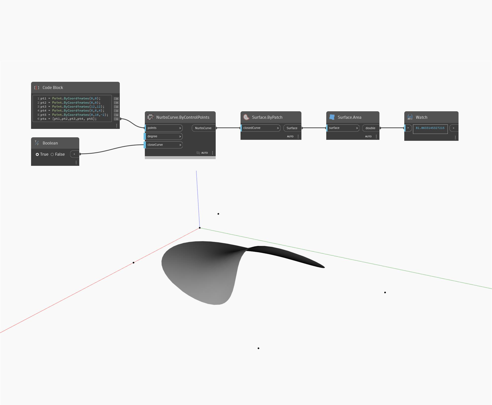

## In Depth
`Surface.Area` returns the area of a given surface. 

In the example below, we create a surface by filling in a NurbsCurve. We then use `Surface.Area` to find the total area of this surface.

___
## Example File

