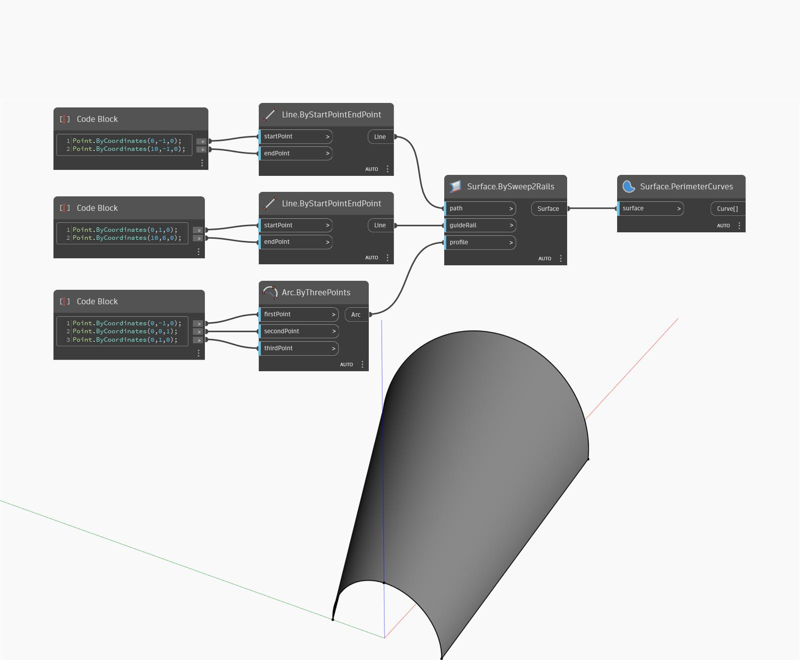

## In Depth
Perimeter Curves will return the edge curves of an open surface as a list of curves. In the example below, we first create a surface by using a BySweep2Rails node. We then extract the perimeter edges by using a PerimeterCurves node. 
___
## Example File

