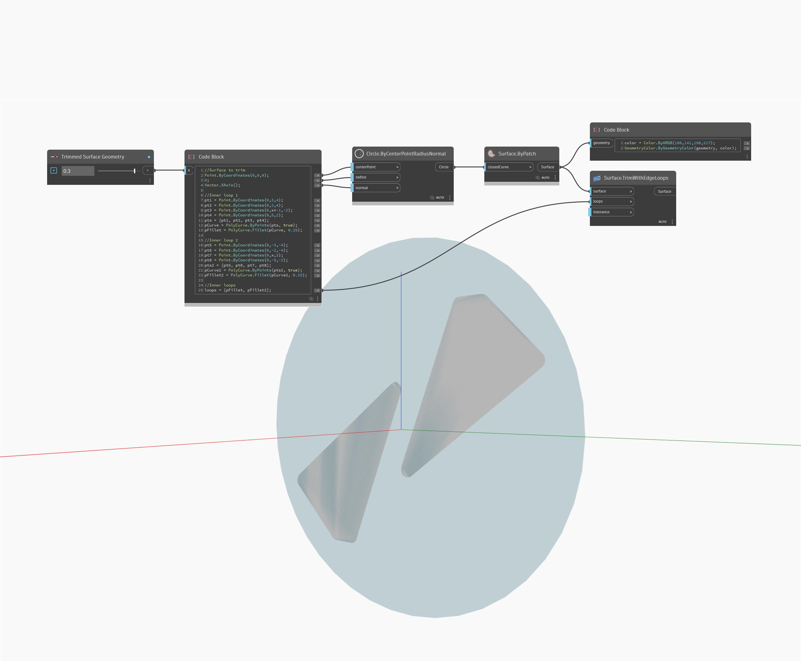

## In Depth
TrimWithEdgeLoops will return a new Surface trimmed from an input Surface. In the example below, two loops are trimmed out of a Surface, returning two new Surfaces highlighted in blue. The number slider will adjust the shape of the new Surfaces. The loops input will take a single PolyCurve or a list of them.
___
## Example File

