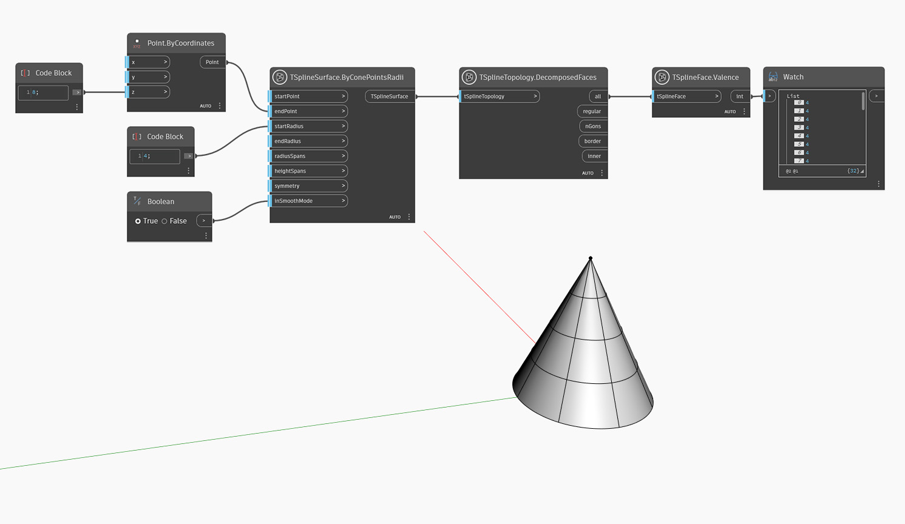

## In-Depth
In the example below, `TSplineFace.Valence`  is used to query the valence of all faces of a T-Spline cone primitive. Note that all faces, including the upper row of the cone, return the Valence value of 4, even if it might seem that the upper row consists of triangles. This is specific to a couple of T-Spline primitive shapes, such as Cone and Sphere, where, to achieve the shape, two of four vertices are stacked in one point. 

## Example File

