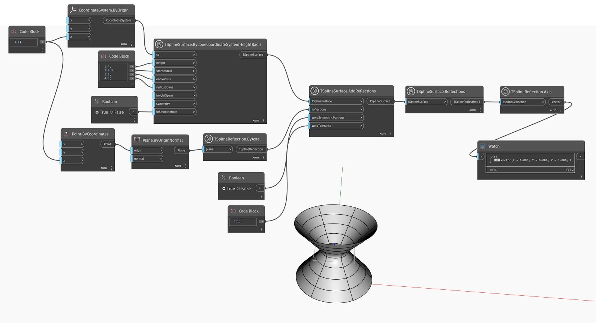

## In-Depth
`TSplineReflection.Axis` returns a vector value that represents the axis around which the T-Spline reflection has taken place. 

In the example below, a T-Spline surface is created with added Reflections. `TSplineSurface.Reflections` is used further down the line to query the reflections applied to the surface. `TSplineReflection.Axis` is then used to return the vector representing the axis of reflection. 

## Example File

