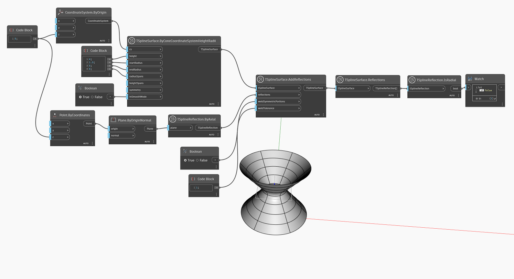

## In-Depth
`TSplineInitialReflection.IsRadial` reports whether a T-Spline reflection is radial by returning a True/False output.

In the example below, `TSplineSurface.Reflections` is used to obtain a list of Reflections applied to the TSplineSurface. `TSplineReflection.IsRadial` node is then used to check if the type of reflection is Radial (returning True) or Axial (returning False). 

## Example File

