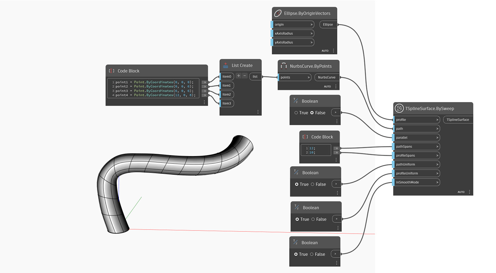

## In Depth
In the example below, a T-Spline surface is created by sweeping a `profile` around a given `path`. The `parallel` input controls if the profile spans remain parallel with the path direction or rotate along it. The definition of the shape is set by `pathSpans` and `radialSpans`. The `pathUniform` input defines if the path spans are distributed uniformly or taking curvature into account. A similar setting, `profileUniform`, controls the spans along the profile. The initial symmetry of the shape is specified by the `symmetry` input. Finally, the `inSmoothMode` input is used to switch between smooth and box mode preview of the T-Spline surface.

## Example File

