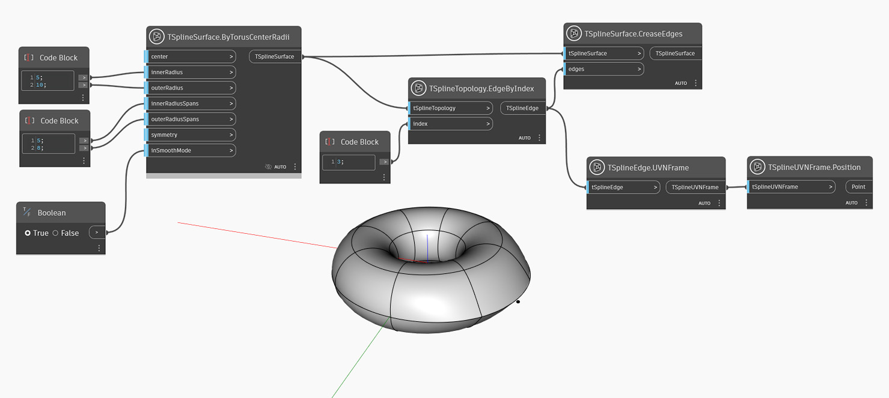

## In-Depth
`TSplineSurface.CreaseEdges` adds a sharp crease to the specified edge on a T-Spline surface.
In the example below, a T-Spline surface is generated from a T-Spline torus. An edge is selected using `TSplineTopology.EdgeByIndex` node and a crease is applied to that edge with the help of `TSplineSurface.CreaseEdges` node. The vertices on both edges of the edge are also creased. The position of the selected edge is previewed with the help of `TSplineEdge.UVNFrame` and `TSplineUVNFrame.Poision` nodes.

## Example File

