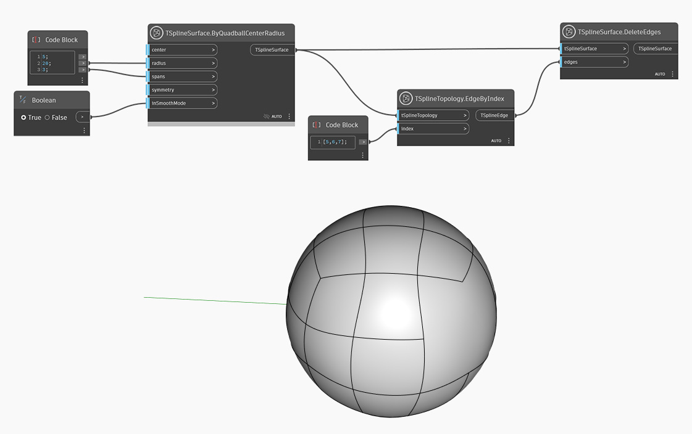

## In Depth

In the example below, a quadball primitive T-Spline surface is created using `TSplineSurface.ByQuadballCenterRadius` node. A set of edges is selected with `TSplineTopology.EdgeByIndex` node and supplied as input into the `TSplineSurface.DeleteEdges` node. 

## Example File

