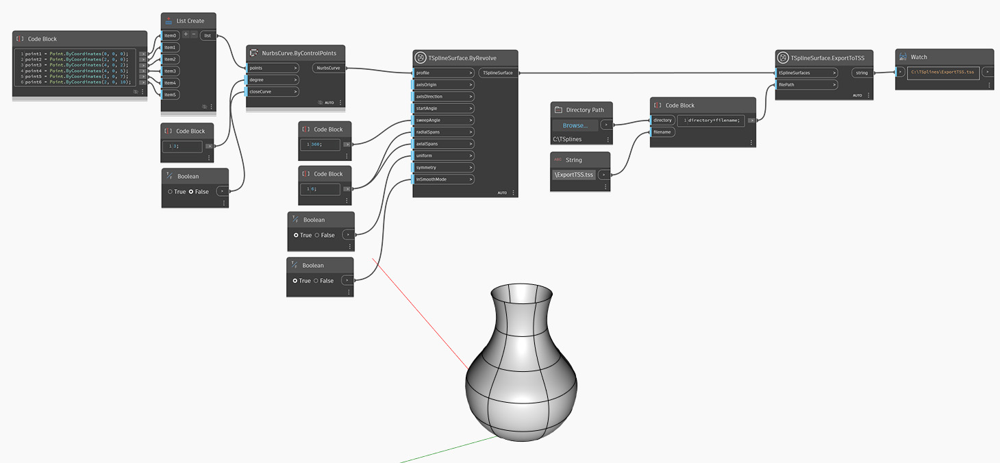

## In Depth
In the example below, a T-Spline surface is created using `TSplineSurface.ByRevolve`, with a NURBS curve as a profile. 
Given a file path, the surface is then exported to a T-Spline Scene file through the `TSplineSurface.ExportToTSS` node.
___
## Example File

