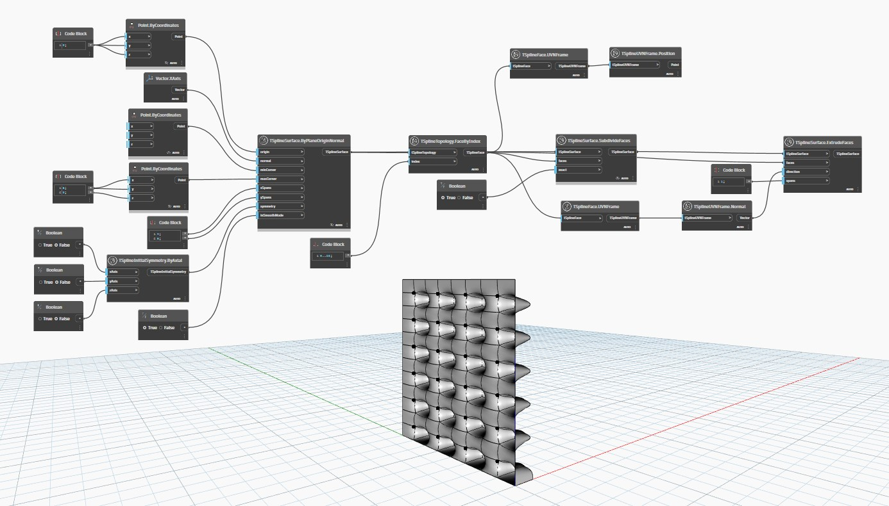

## In Depth
In the example below, a planar T-Spline surface is created using `TSplineSurface.ByPlaneOriginNormal`, and a set of its faces are selected and subdivided. Those faces are then symmetrically extruded using the `TSplineSurface.ExtrudeFaces` node, given a direction (in this case the faces' UVN Normal vector) and a number of spans. The resulting edges are displaced in the specified direction.
___
## Example File

