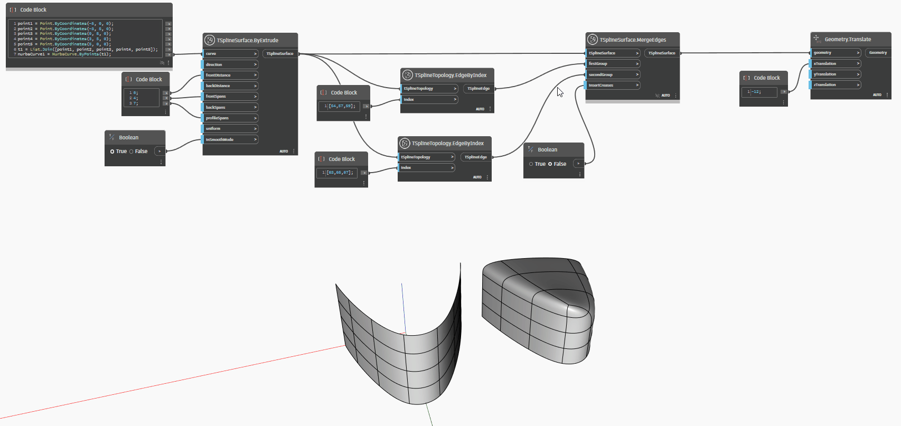

## In Depth
In the example below, a T-Spline surface is created by extruding a NURBS curve. Six of its edges are selected with a `TSplineTopology.EdgeByIndex` node - three on each side of the shape. The two sets of edges, along with the surface, are passed into the `TSplineSurface.MergeEdges` node. The order of edge groups impacts the shape - the first group of edges is displaced to meet the second group, which remains in the same place. The `insertCreases` input adds the option of creasing the seam along the merged edges. The result of the merge operation is translated to the side for a better preview. 
___
## Example File

