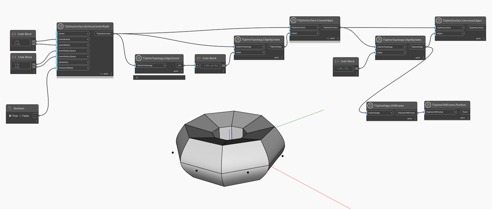

## In-Depth
Opposite to the `TSplineSurface.CreaseEdges` node, this node removes the crease of the specified edge on a T-Spline surface.
In the example below, a T-Spline surface is generated from a T-Spline torus. All edges are selected using `TSplineTopology.EdgeByIndex` and `TSplineTopology.EdgesCount` nodes and crease is applied to all edges with the help of `TSplineSurface.CreaseEdges` node. A subset of the edges with indices 0 to 7 is then selected and the reverse operation applied - this time, using the `TSplineSurface.UncreaseEdges` node. The position of the selected edges is previewed with the help of `TSplineEdge.UVNFrame` and `TSplineUVNFrame.Poision` nodes.

## Example File

