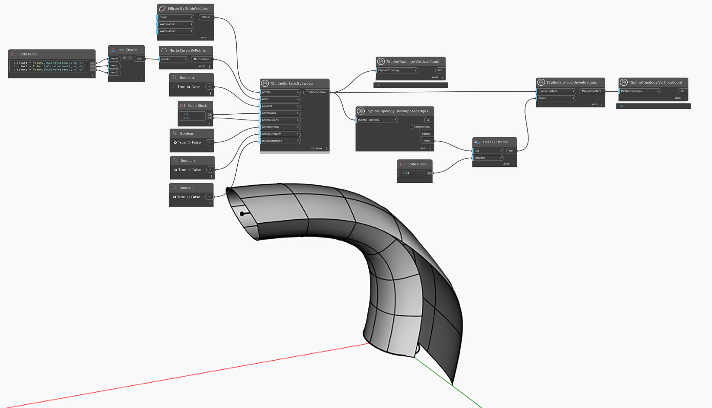

## In-Depth

In the example below, Unweld operation is performed on row of edges of a T-Spline surface. As a result, the vertices of selected edges are disjointed. Unlike Uncrease, which creates a sharp transition around the edge while maintaining the connection, Unweld creates a discontinuity. This can be proven by comparing the number of vertices before and after the operation was performed. Any subsequent operations on unwelded edges or vertices will also demonstrate that the surface is disconnected along the unwelded edge. 

