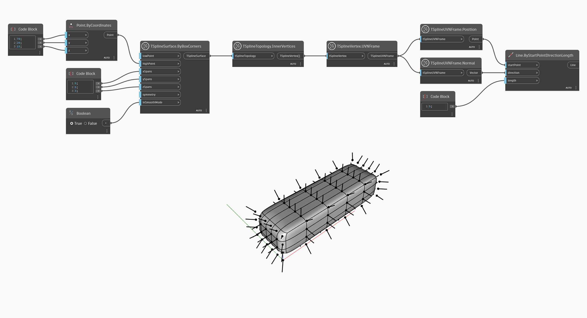

## In-Depth
`TSplineUVNFrame.Normal` returns the vector normal of the UVN Frame. 
In the example below, this node is used together with the `TSplineUVNFrame.Position` node to visualize the normals of the vertices of a T-Spline surface.

## Example File

