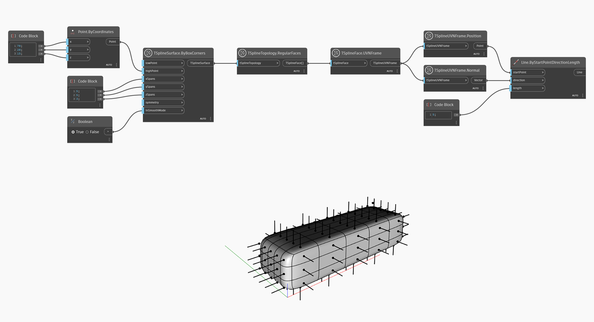

## In-Depth
`TSplineUVNFrame.Position` returns the position of the UVN frame as a Point object. This node can be used to visualize the position of the Vertex or Face of the surface when selecting these elements by index. 
In the example below, this node is used to visualize the direction of each regular face on the surface. 

## Example File

