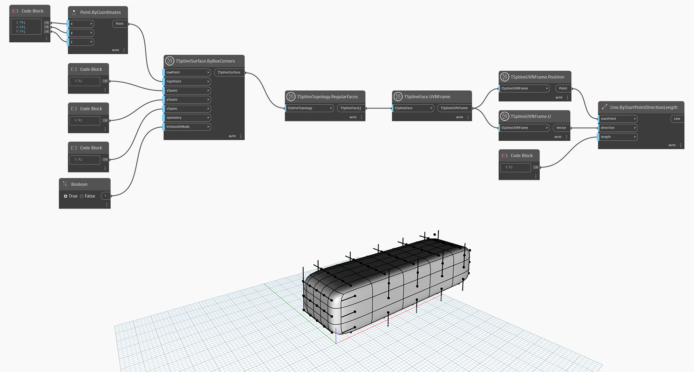

## In-Depth
`TSplineUVNFrame.U` returns the U vector of the UVN Frame. In the example below, lines are used to visualize the direction of the U vector on UVN frames of each face of the T-Spline box primitive. 

## Example File

