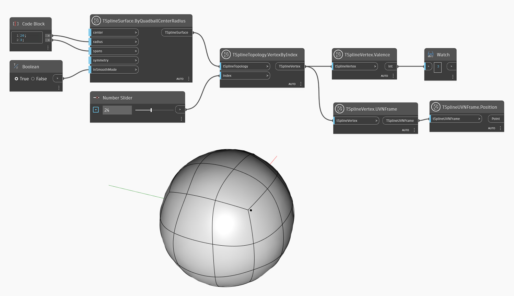

## In-Depth
`TSplineVertex.Valence` returns the number of edges connected to a vertex in a control mesh. The valence of a vertex has an impact on the smoothness and shape of the surface. 

In the example below, `TSplineVertex.Valence`  node is used to check the valence of a vertex on a primitive T-Spline surface. The valence of the chosen vertex is "3" which is specific for some star points and T-Points. The UVN Frame is used to visualize the position of the vertex being examined.

## Example File

