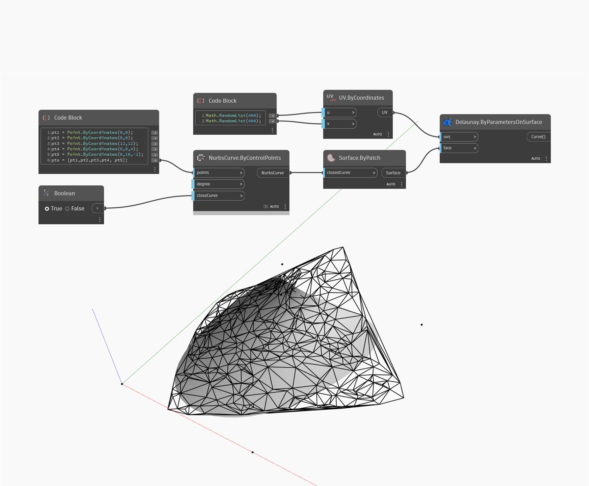

## In Depth
`UV.ByCoordinates` will return a UV from two lists of doubles. U and V are the horizontal and vertical coordinates, respectively, that define how 2D textures are applied to a 3D surface. 

In the example below, a UV is returned from 400 random values to create a Delaunay triangulation of a NurbsSurface.

___
## Example File

