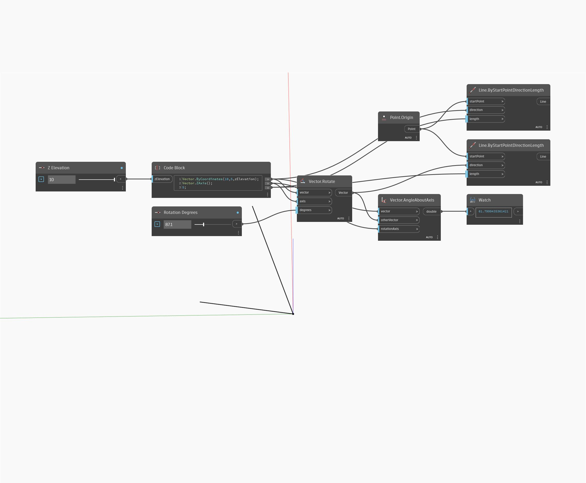

## In Depth
AngleAboutAxis will return the angle measurement between two Vectors in degrees from 0 to 360 and about an axis of rotation. In the example below, the angle between two Vectors is measured about the Z axis. Adjust Z Elevation and Rotation Degrees sliders to see how they affect the resulting angle measurement. The Vectors are represented as Lines.
___
## Example File

