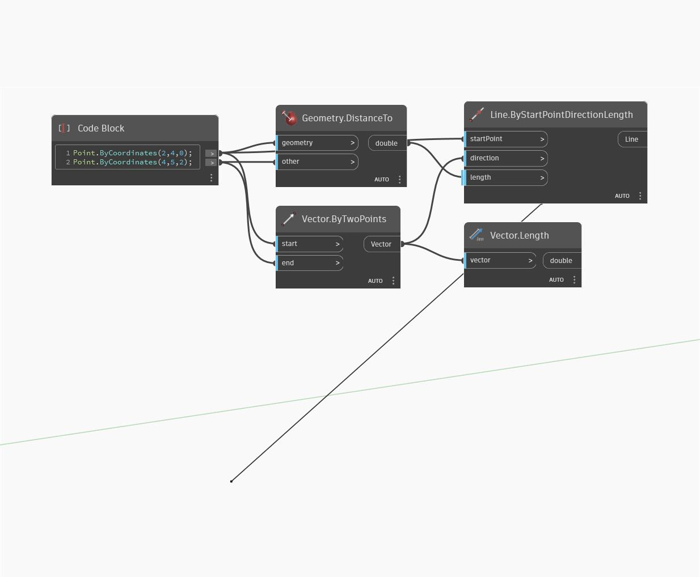

## In Depth
ByTwoPoints will return a Vector defined by two Point locations. In the example below, a Vector created by two Points is represented by a Line. The Vector's length is 3, equal to the distance between Points.
___
## Example File

