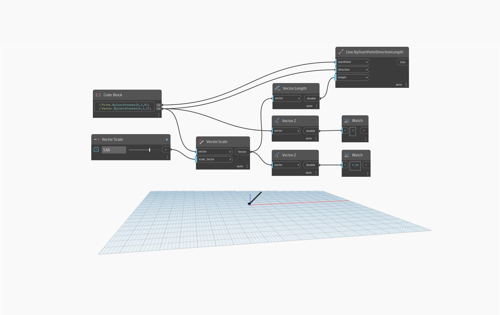

## In Depth
`Vector.Z` returns a double representing a reference point’s Z coordinate value.

In the example below, two `Vector.Z` nodes are used to compare the Z coordinate values of an original and scaled vector.

___
## Example File

