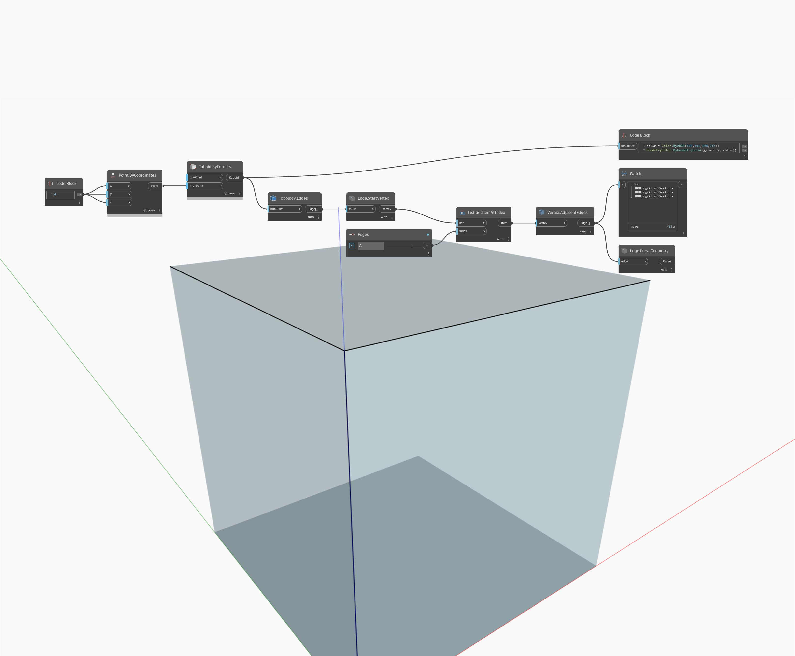

## In Depth
AdjacentEdges will return the Edges that emanate from a Vertex. In the example below, the Edges emanating from a Vertex on a Cube are represented as Lines. Adjust the Edges slider to return different sets of adjacent Edges.
___
## Example File

