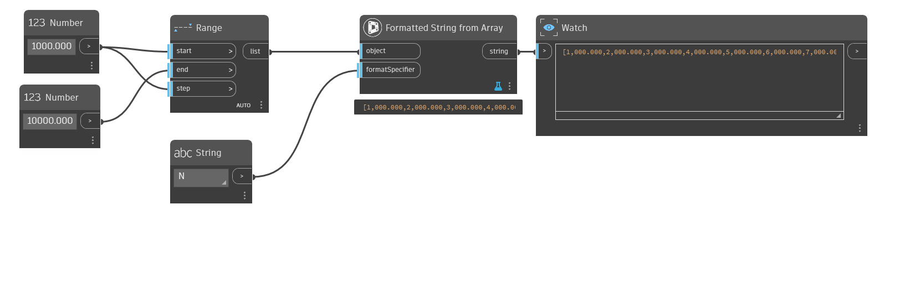

## In Depth
This node will convert an array to a string. The second input `format specifier` controls how numeric inputs are converted to their string representations. 
This `format specifier` inputs should be one of the c# standard format numeric specifiers.

format specifiers should be in the form:
`<specifier><precision>` for example F1

Some commonly used format specifiers are:
```
G : general formatting G 1000.0 -> "1000"
F : fixed point notation F4 1000.0 -> "1000.0000"
N : number N2 1000 -> "1,000.00"
```

The default for this node is `G`, which will output a compact, but variable representation.

[see the microsoft documentation for more detailed information.](https://learn.microsoft.com/en-us/dotnet/standard/base-types/standard-numeric-format-strings#standard-format-specifiers)
___
## Example File

