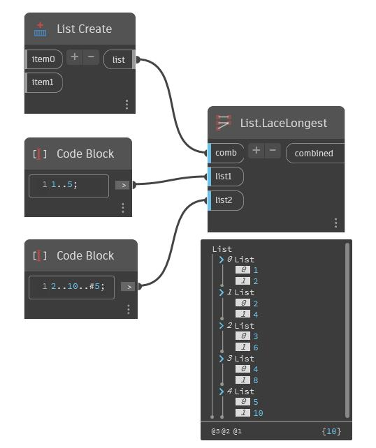

## In Depth
Applies a combinator to each pair resulting from a longest lacing of the input lists. All lists have their last element repeated to match the length of the longest input.
___
## Example File

