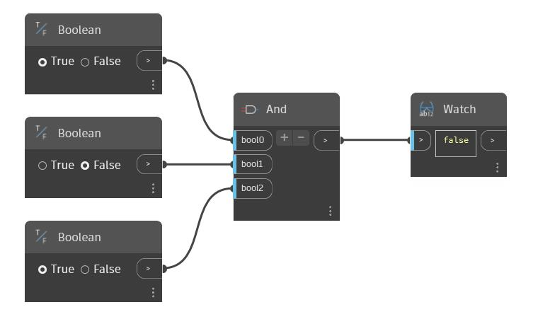

## In Depth
And will take a variable number of boolean inputs. You can increase or decrease the number of inputs by using the '+' and '-' buttons on the And node. Each input must be a single boolean value. And will return 'true' if all of the inputs are true, otherwise it will return 'false'. In the example below, we have three boolean toggles used as inputs for an And node. When all three are set to 'true', And will return 'true'.
___
## Example File

