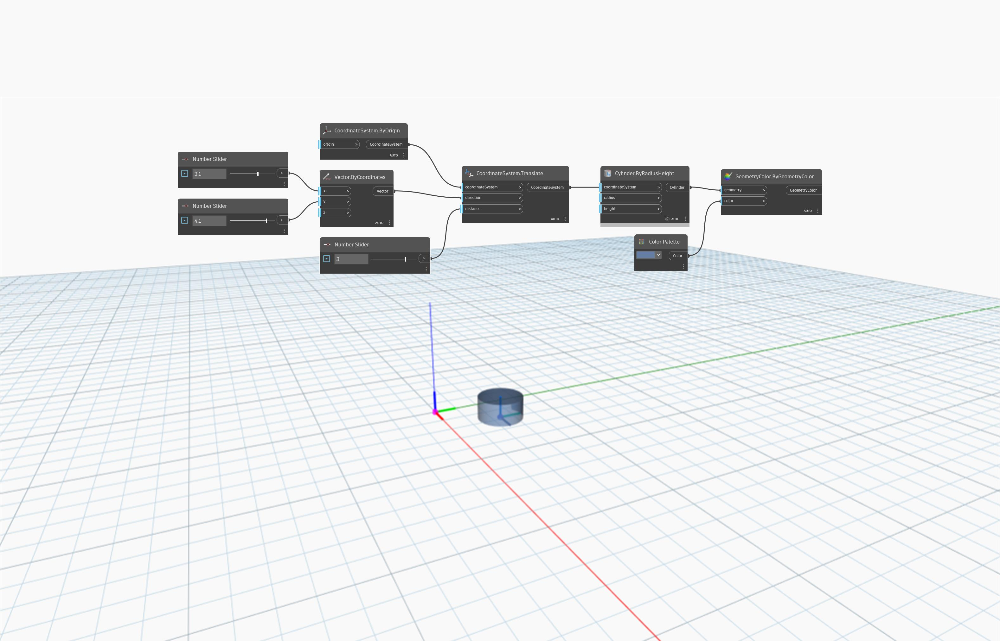

<!--- Autodesk.DesignScript.Geometry.CoordinateSystem.Translate(coordinateSystem, direction, distance) --->
<!--- D7TPJG7RLZUUPHJENWETOGTAX7U3ZWFXG4BAAHEGVXCRSUW3IVCQ --->
## In Depth
`CoordinateSystem.Translate (coordinateSystem, direction, distance)` returns a new CoordinateSystem translated by an input vector and distance. 

In the example below, a CoordinateSystem at the origin is translated in a direction by the input vector of (3.1, 4.1, 0) and a distance of 3. The `distance` input overrides the `vector` input’s length. The new CoordinateSystem is identified with a cylinder created on it.

___
## Example File

