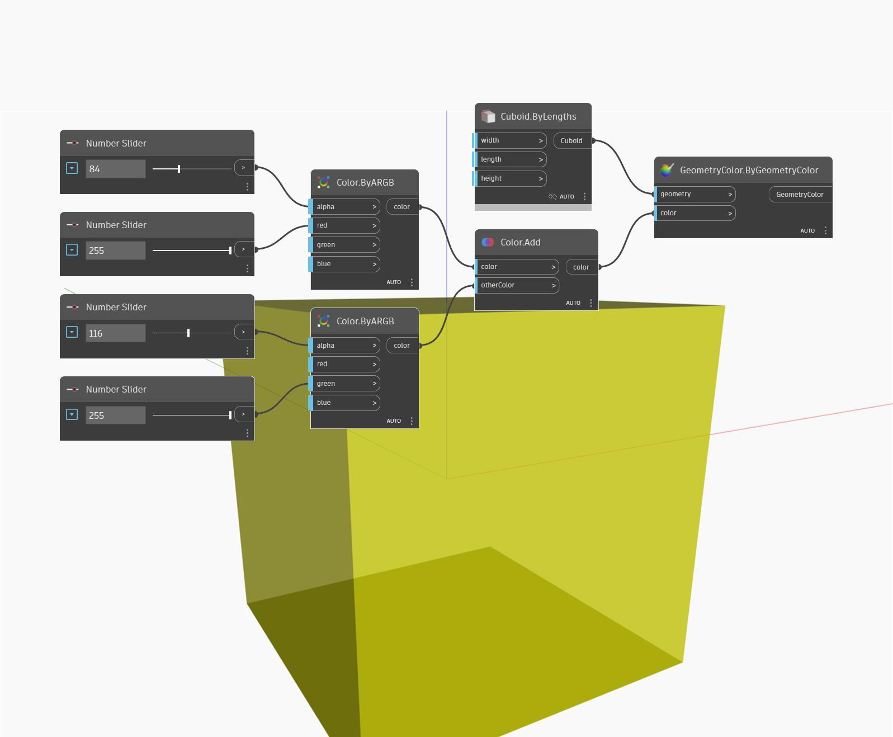

## In Depth
Add will return a Vector that is the sum of two other Vectors. In the example below, the sum of the WCS Z axis and X axis Vectors results in a Vector with coordinates of (1,0,1). The new Vector is represented as a Line.
___
## Example File

