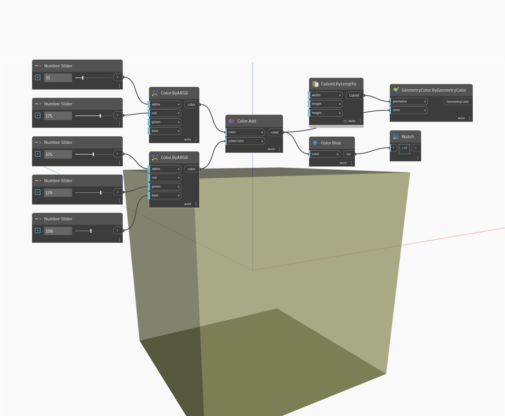

## In Depth
Blue will return the blue value of an input color in the range 0 to 255. In the example below, we create two colors using ByARGB nodes, and then add the two colors together. The blue value of the resulting color is found by using a Blue node.
___
## Example File

