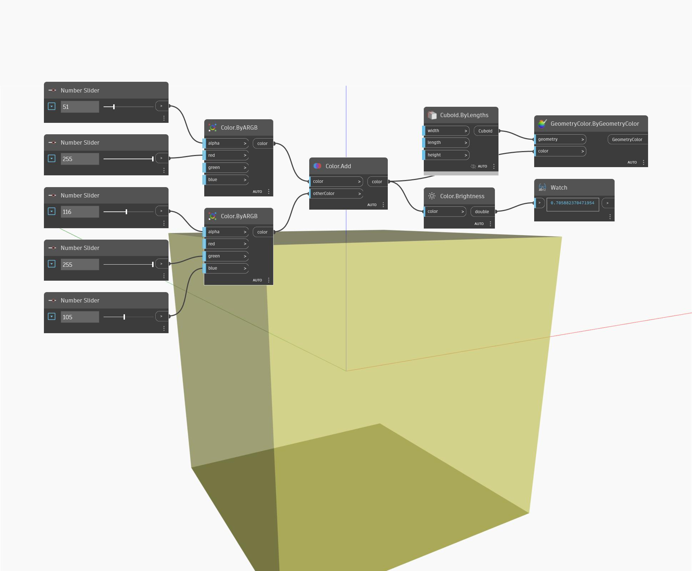

## In Depth
Brightness will return the brightness value of an input color in the range 0 to 1. In the example below, we create two colors using ByARGB nodes, and then add the two colors together. The brightness value of the resulting color is found by using a Brightness node.
___
## Example File

