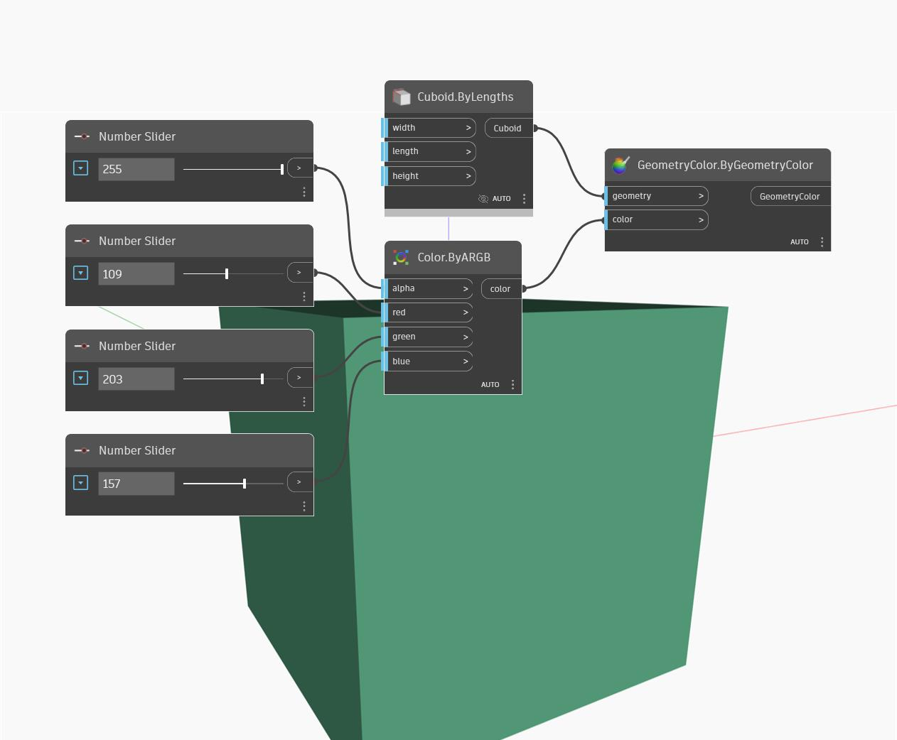

## In Depth
ByARGB will create a color using input Alpha, Red, Green, and Blue values. The input values are in the range 0 to 255. In the example below, we use 4 number sliders set to the range 0 to 255 to control the input values of a ByARGB node. A Display.ByGeometryColor node is used with a default cuboid in order to visualize the resulting color.
___
## Example File

