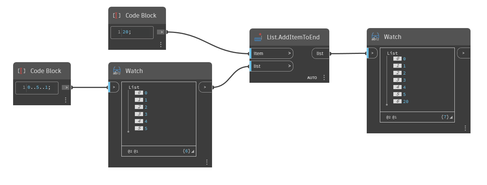

## In Depth
`List.AddItemtoEnd` inserts a given item to the end of a given list. Note that if a list object is used as the item to add, the entire list is added as a single object, producing a nested list. To combine two lists together into a single flat list, see `List.Join`. 

In the example below, we use a code block to generate a range of numbers from 0 to 5, stepping by 1. We then add a new item, the number 20, to the end of that list using `List.AddItemToEnd`.
___
## Example File

