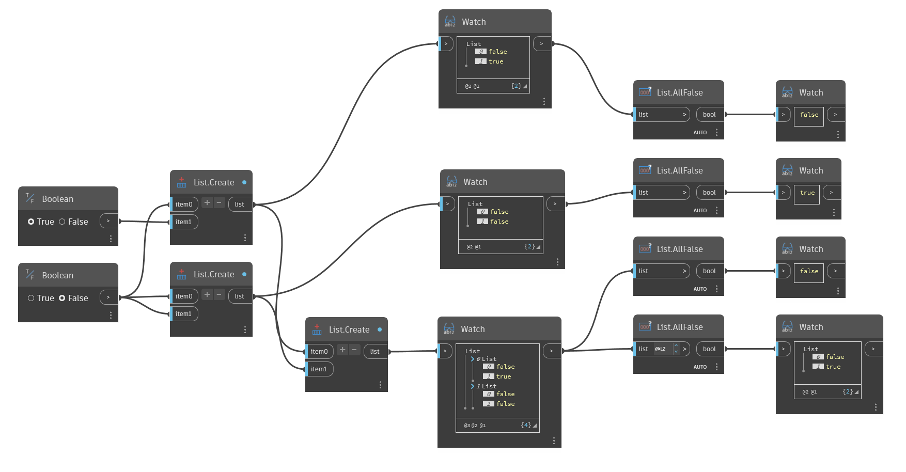

## In Depth
`List.AllFalse` returns False if any item in the given list is True or not a Boolean. `List.AllFalse` only returns True if every item in the given list is Boolean and False.

In the example below, we use `List.AllFalse` to evaluate lists of Boolean values. The first list has a True value, so False is returned. The second list has only False values, so True is returned. The third list has a sublist that includes a True value, so False is returned. The final node evaluates the two sublists and returns False for the first sublist because it has a True value, and True for the second sublist because it has only False values.
___
## Example File

