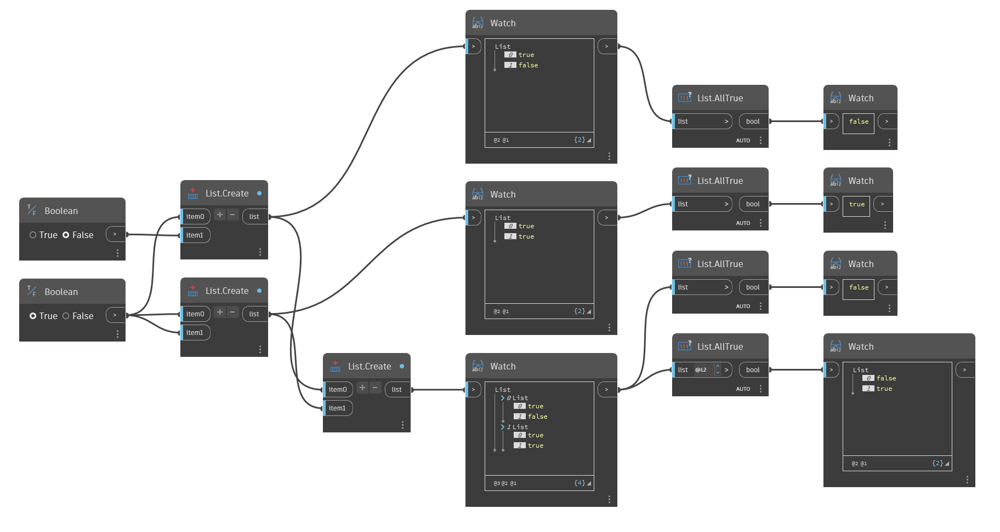

## In Depth
`List.AllTrue` returns False if any item in the given list is False or not a Boolean. `List.AllTrue` only returns True if every item in the given list is Boolean and True. 

In the example below, we use `List.AllTrue` to evaluate lists of Boolean values. The first list has a False value, so False is returned. The second list has only True values, so True is returned. The third list has a sublist that includes a False value, so False is returned. The final node evaluates the two sublists and returns False for the first one because it has a False value, and True for the second one because it has only True values.
___
## Example File

