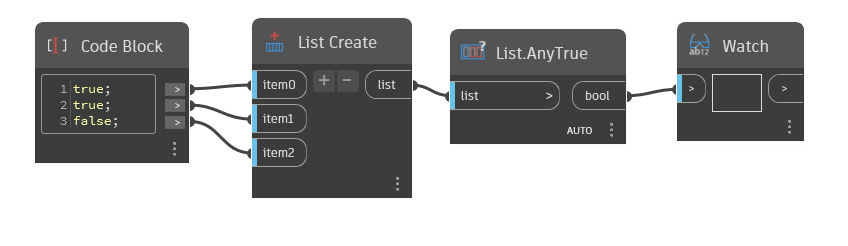

## In Depth
`List.AnyTrue` returns True if the given list has at least one True Boolean value.

In the example below, we use `List.AnyTrue` to determine if the list has True values. There are 2 True values, so AnyTrue returns True.
___
## Example File

