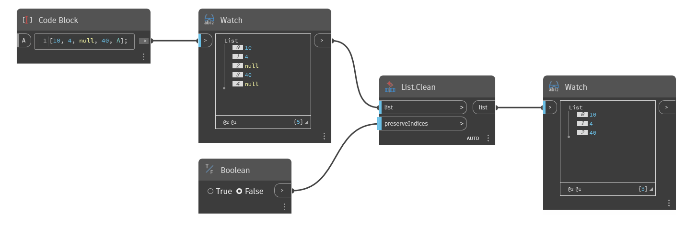

## In Depth
`List.Clean` returns a list without nulls and empty lists.

In the example below, `List.Clean` removes two null values from a list, returning only the integers. The `preserveIndices` input can be toggled by a Boolean value to keep the indices that once contained nulls.
___
## Example File

