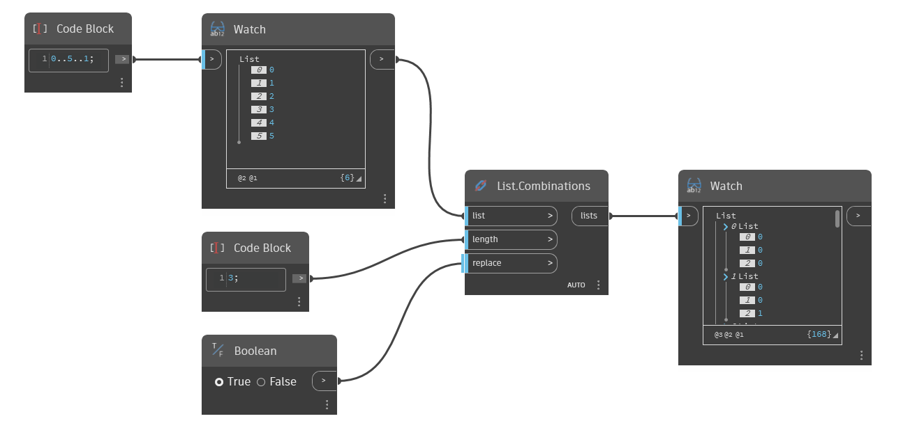

## In Depth
`List.Combinations` returns a nested list that includes all possible combinations of the items in the input list with a given length. For combinations, the order of elements does not matter, so the output list (0,1) is considered the same combination as (1,0). If `replace` is set to True, items will be replaced into the original list, allowing for them to be used repeatedly in a combination. 

In the example below, we use a code block to generate a range of numbers from 0 to 5, stepping by 1. We use `List.Combinations` with an input length of 3 to generate all the different ways to combine 3 of the numbers in the range. The `replace` Boolean is set to True, so numbers will be used repeatedly.
___
## Example File

