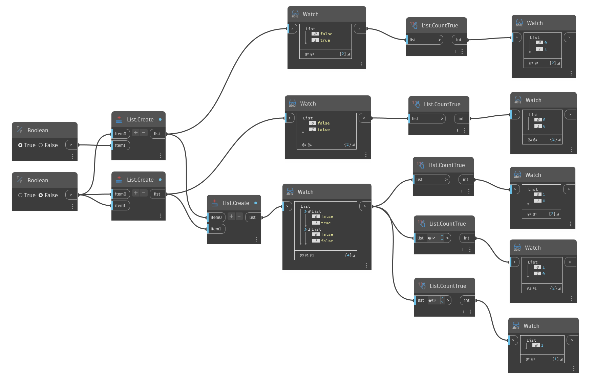

## In Depth
`List.CountTrue` returns the number of True Boolean values in the input list or lists.

In the example below, we use `List.CountTrue` to return the number of True values in lists of Boolean values.

___
## Example File

