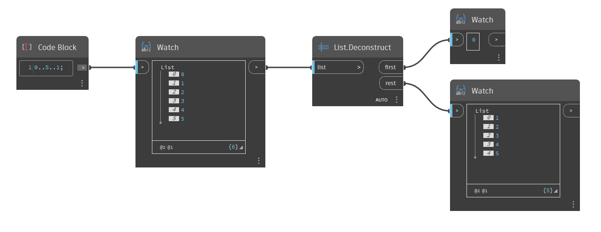

## In Depth
`List.Deconstruct` separates the first item in a list from the remainder. This node has two outputs. The first output is the first item of the original list. The second output is a list with the remaining elements from the original list. 

In the example below, we first use a code block to generate a range of numbers from 0 to 5, stepping by 1. We then use a `List.Deconstruct` node to separate the first item from the remainder. The result is the item 0 as the first output, and a list of the range from 1 to 5 as the second output.
___
## Example File

