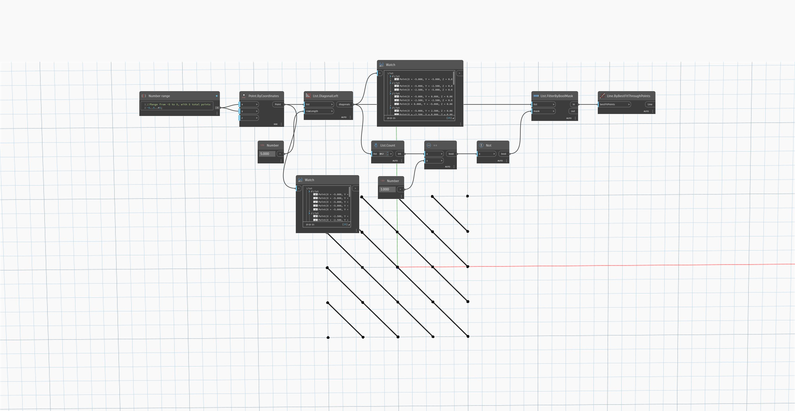

## In Depth
`List.DiagonalLeft` returns a new list of lists of elements along each diagonal in the list matrix from bottom left to top right.

In the example below, we create a grid of points with lines running through them diagonally. `List.DiagonalLeft` returns a list of the points diagonally from the bottom left of the grid to the top right.

___
## Example File

