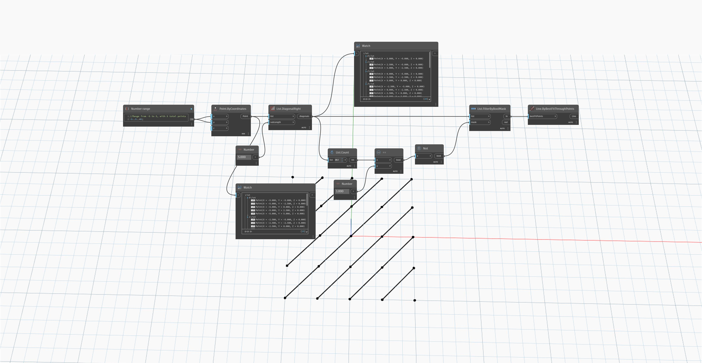

## In Depth
`List.DiagonalRight` returns a new list of lists of values along each diagonal in the list matrix from bottom right to top left. 

In the example below, we create a grid of points with lines running through them diagonally. `List.DiagonalRight` returns a list of the points diagonally from the bottom right of the grid to the top left.

___
## Example File

