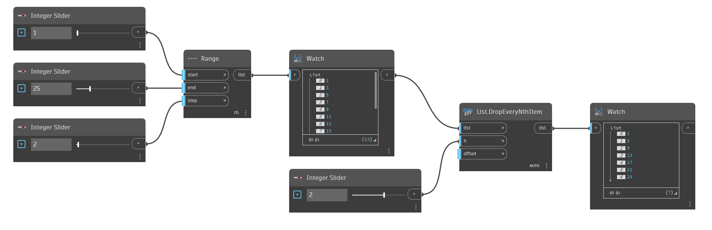

## In Depth
`List.DropEveryNthItem` removes items from the input list at intervals of the input n value. The starting point of the interval can be changed with the `offset` input. For example, inputting 3 into n and leaving the offset as the default of 0 will remove items with indices 2, 5, 8, etc. With an offset of 1, items with indices 0, 3, 6, etc. are removed. Note that the offset “wraps” through the entire list. To keep selected items instead of removing them, see `List.TakeEveryNthItem`. 

In the example below, we first generate a list of numbers using `Range`, and then remove every other number by using 2 as the input for `n`.
___
## Example File

