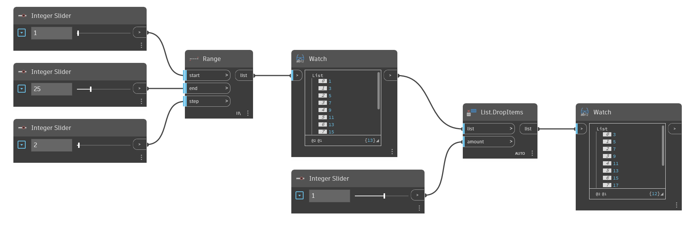

## In Depth
`List.DropItems` removes the number of items from a list specified by the `amount` input. If the `amount` input is positive, the items are removed from the beginning of the list. If the `amount` input is negative, the items are removed from the end of the list. 

In the example below, we first create a list using `Range`, then remove the first item from the list by using `List.DropItems` with an `amount` input of 1. Since the `amount` input is positive, the item is removed from the beginning of the list.
___
## Example File

