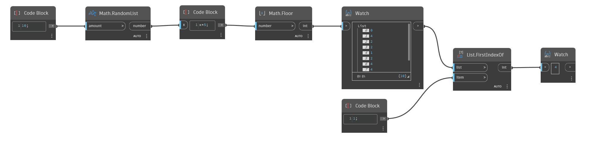

## In Depth
`List.FirstIndexOf` searches through a given list for an item specified in the Item input and returns the index of the first instance of that item on the list. The node returns -1 if the item is not found on the list.

In the example below, we first generate a list of 10 random numbers between 0 and 4. By using a `List.FirstIndexOf node`, we search for a specific item and retrieve the index of the first time that item is found in the list.
___
## Example File

