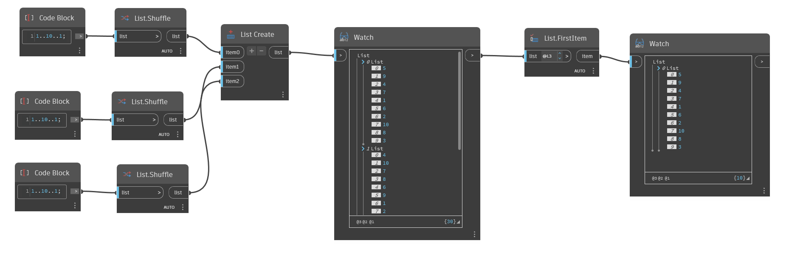

## In Depth
`List.FirstItem` returns the first item of an input list. 

In the example below, we generate a list with three sublists of 10 random numbers between 1 and 10. We then use a FirstItem node to return the first item of the list. 

Use the list level picker in the `List.FirstItem` node to experiment with different ways to return the first item from a nested list. Setting it to L1 returns all items from all sublists as a single, flat list. Setting it to L2 returns the first item of each sublist. Setting it to L3 returns all items on the 0 list.
___
## Example File

