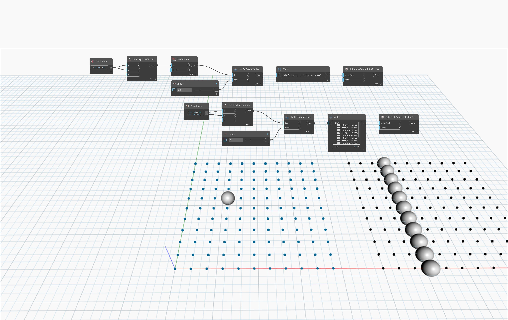

## In Depth
`List.Flatten` returns a one-dimensional list (a list with a single level) from a multi-dimensional list (a list with at least one nested list). 

In the example below, two list structures of a point grid are compared by creating a sphere at a specified index of each grid. The flattened list of points returns 1 point at an index location. The unflattened list returns 10 points at an index location, as each index contains a row of points.
___
## Example File

